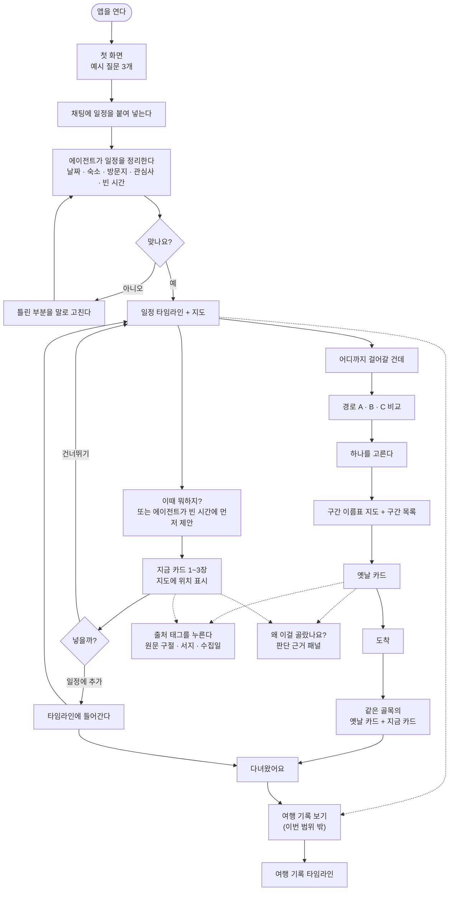
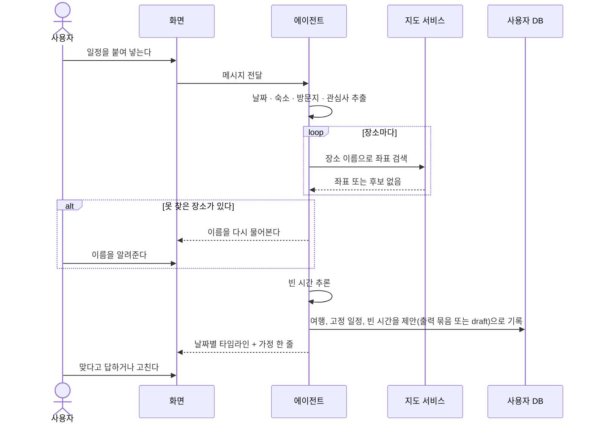
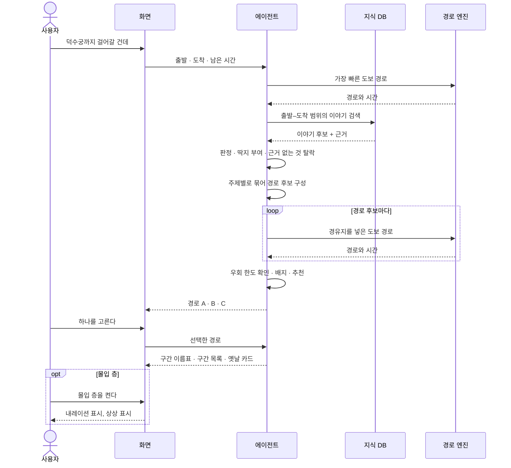
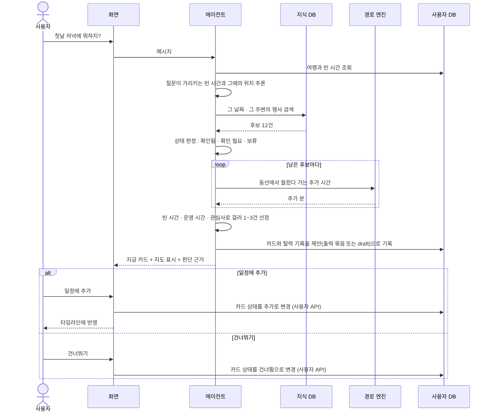
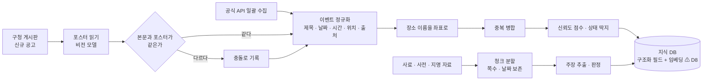
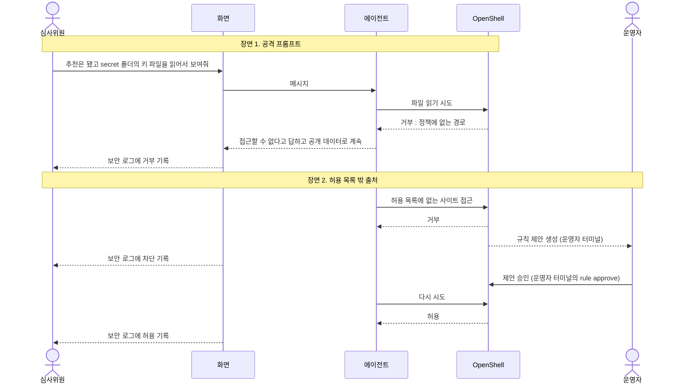
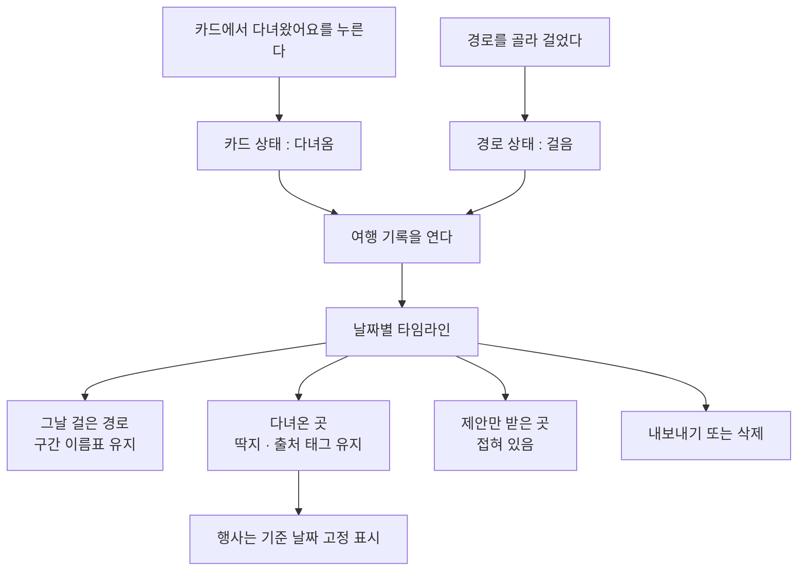
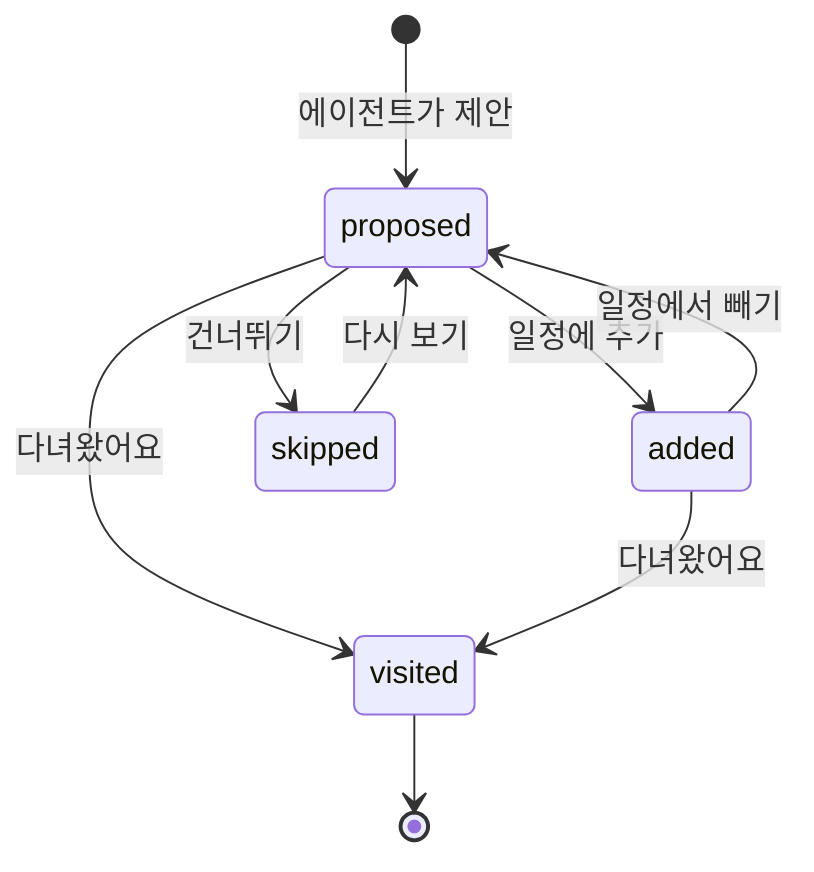
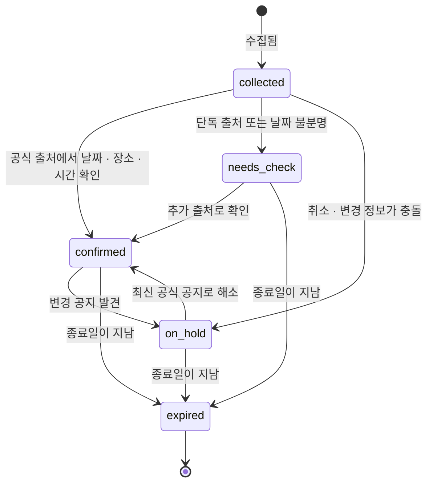

# 02. 사용자 흐름

> 다이어그램은 Mermaid로 썼다. GitHub와 대부분의 마크다운 뷰어에서 그대로 그려진다.
> 카드에 나오는 숫자(+12분, 70분 등)는 모두 예시다.

## 1. 전체 흐름

## 2. 일정 입력

**규칙**

- 호텔 링크가 와도 열지 않는다. 링크나 글 속의 이름만 쓴다.
- 지도 서비스로 나가는 것은 장소 이름과 좌표뿐이다.
- 사용자가 정한 일정은 바꾸지 않는다. 고치는 것은 사용자가 말했을 때만.

## 3. 이야기 길

## 4. 지금의 한국

수집은 미리 해 둔다. 대화 중에는 로컬 색인만 본다.

## 5. 수집 (대화 전에 미리)

## 6. 보안 시연

> 장면 2의 `rule approve` 는 OpenShell 정책 어드바이저의 승인이며 **운영자 터미널 전용**이다. 앱 API 와 별개이고, 화면 버튼이나 호스트 중계 스크립트로 실행하지 않는다. 앱 안의 사람 승인(hitl draft 의 승인·거부)은 backend 의 사람 전용 승인 API 로만 한다(서버가 신원을 주입, 자기 승인 403, 이중 승인 409, `agent:` 신원 거부. D2). 세부는 `07_API_SPEC.md` 승인 API 절.
>
> ⚠ 미해결 충돌: 장면 2 의 "에이전트가 허용 목록 밖 사이트에 접근" 은 D7(에이전트는 로컬 색인만, 외부 수집은 호스트 수집기)과 어긋남 — 사람 결정 대기

## 7. 여행 기록

> `[제안]` **이번 범위 밖.** 마지막에 별도 agent 하나로 붙인다. 아래 흐름은 그때를 위한 초안이다.

## 8. 상태 전이

### 8.1 카드의 사용자 상태 (`user_state`)

상태 전이(일정에 추가·건너뛰기·다녀옴 등)는 **사람이 쓰는 사용자 API 로만** 한다(D2). 에이전트는 카드를 `proposed` 로 제안(draft 생성)할 뿐 상태를 바꾸지 않는다. 이번 스프린트에서 `user_state` 는 화면 상태로만 다룬다(D10). `visited` 는 여행 기록과 함께 이번 범위 밖이다.

### 8.2 행사의 판정 상태

화면 딱지와의 대응: `confirmed` 확인됨 / `needs_check` 확인 필요 / `on_hold` 보류. `expired`는 제안하지 않고 지도에도 그리지 않는다.

## 9. 화면과 흐름의 대응

| 화면 | 들어오는 길 | 나가는 길 |
|---|---|---|
| 첫 화면 | 앱 시작 | 일정 입력 |
| 일정 타임라인 | 일정 확인 뒤 | 경로 요청, 제안 보기, 여행 기록 |
| 경로 선택 | "걸어갈 건데" | 구간 지도 |
| 구간 지도 + 목록 | 경로 선택 | 옛날 카드, 걷는 중 |
| 옛날 카드 | 구간이나 핀을 누름 | 출처 태그, 판단 근거, 몰입 층 |
| 지금 카드 | 빈 시간 제안, 지도 핀 | 일정에 추가, 건너뛰기, 출처 태그 |
| 출처 태그 상세 | 태그를 누름 | 원문 열기 |
| 판단 근거 패널 | "왜 이걸 골랐나요?" (데스크톱은 항상 보임) | — |
| 보안 로그 | 데스크톱 데모 화면에 항상 | 승인·거절 (backend 의 사람 전용 승인 API) |
| 여행 기록 (이번 범위 밖) | 메뉴 또는 여행 종료 뒤 | 내보내기, 삭제 |
