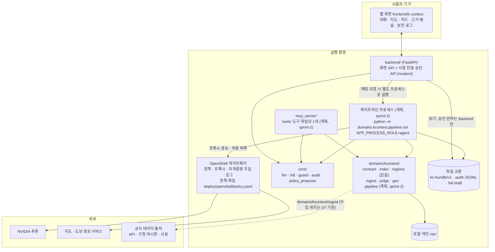
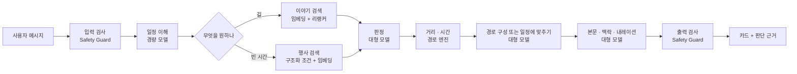

# 03. 시스템 구조

> 원칙: **LLM은 의미를 판단하고, 숫자·권한·접근 제어는 도구와 정책이 결정한다.**
> 기술 선택은 `[제안]`이다. OpenShell 사용은 `[확정]`이다.

## 1. 구성도

> 프로세스 경계는 D3·D10 을 따른다. **한 샌드박스 안의 한 프로세스가 아니다.** 화면 API·사람 승인(`backend/`), MCP 도구(`mcp_server/`), 파이프라인(`domains/kcontext/pipeline`, `APP_PROCESS_ROLE=agent`)은 별도 프로세스이고, `backend` 와 `mcp_server` 는 서로 import 하지 않는다. 공통 로직은 `core/` 에 둔다. 어느 프로세스를 OpenShell 샌드박스 안에서 돌릴지는 이 문서가 정하지 않는다. 현재 레포에 있는 것은 `domains/kcontext/{contract, index, regions}`, `core/`, `backend/` 이고, `domains/kcontext/{ingest, judge, geo, pipeline}`, `mcp_server/tools/` 의 도구 파일, `core/policy_proposer/openshell_log.py` 는 **계획(sprint-2)** 이며 아직 없다(`mcp_server/tools/` 는 빈 패키지).

- `backend` 는 `domains`·`mcp_server` 를 import 하지 않는다(D10). 파이프라인과는 `kc-bundle/v1` 파일, audit JSONL, hitl draft 로만 주고받는다.
- 에이전트 쪽 쓰기는 draft 생성뿐이고 상태 전이(승인·반려)는 backend 의 사람 전용 승인 API 에만 있다(D2).

> ⚠ 미해결 충돌: D1·D6 와 어긋남(추론 경로: 구성도 이전 초안의 로컬 NIM·`integrate.api.nvidia.com` 직접 호출) — 사람 결정 대기
> ⚠ 미해결 충돌: D7 과 어긋남(수집 위치: ingest 샌드박스 대 호스트 수집기) — 사람 결정 대기

## 2. 구성 요소

| 요소 | 하는 일 | 위치·기술 |
|---|---|---|
| 웹 화면 | 대화, 지도, 카드, 판단 근거 패널, 보안 로그 | `frontend/k-context/`. 지도는 MapLibre 또는 Leaflet `[제안]` ⚠ 미해결 충돌: D11 과 어긋남 — 사람 결정 대기 |
| 화면 API + 사람 승인 | 화면의 읽기·채팅 요청, 사람 전용 승인 | `backend/`(FastAPI, `routers/`). 승인 라우터는 서버가 신원을 주입한다. 진행 이벤트는 SSE `[제안]` ⚠ 미해결 충돌: D10 과 어긋남(세션·SSE) — 사람 결정 대기 |
| 파이프라인 | 에이전트 단계를 순서대로 실행하고 출력 묶음(`kc-bundle/v1`)을 쓴다 | `domains/kcontext/pipeline`(계획, sprint-2). 별도 프로세스(`APP_PROCESS_ROLE=agent`) |
| 도구 계층 | 모델이 부르는 함수들. 쓰기는 draft 생성뿐 | `mcp_server/tools/`(파일당 1개, 계획 sprint-2), 구현은 `domains/kcontext/` |
| 도메인 | 계약·색인·지역·수집·판정·지리·파이프라인 | `domains/kcontext/{contract, index, regions}` 있음. `{ingest, judge, geo, pipeline}` 는 계획(sprint-2) |
| 공통 뼈대 | LLM 호출, hitl draft, 가드, audit, 정책 초안 | `core/{llm, hitl, guard, audit, policy_proposer}` 있음. `policy_proposer/openshell_log.py` 어댑터만 계획(sprint-2) |
| 로컬 색인 | 이야기, 행사, 출처, 문서 조각 | `var/` 아래 SQLite 등. 에이전트 쪽은 읽기만 ⚠ 미해결 충돌: D8 과 어긋남(임베딩·sqlite-vec 가정. 05 참조) — 사람 결정 대기 |
| 사용자 DB | 여행, 대화, 카드 상태, 판단 기록 | SQLite 파일 `[제안]`. 카드 상태 전이는 사람이 쓰는 사용자 API 로만. ⚠ 미해결 충돌: D10 과 어긋남(`user_state` 는 이번 스프린트에서 화면 상태로만 다루고, 판단 기록은 `rationale.json`) — 사람 결정 대기 |
| 로컬 NIM | 임베딩, 리랭킹, 포스터 읽기, 안전 검사, 가벼운 추출 | L40S 위의 NIM 컨테이너 `[제안]` ⚠ 미해결 충돌: D1·D6 와 어긋남 — 사람 결정 대기 |
| 호스팅 모델 | 판정, 경로 구성, 서사, 설명 | build.nvidia.com 엔드포인트 `[제안]` ⚠ 미해결 충돌: D1 과 어긋남 — 사람 결정 대기 |
| 수집 작업 | 출처에서 자료를 모아 색인을 만든다 | `domains/kcontext/ingest/`(계획, sprint-2). 대화와 분리해 미리 실행 |
| OpenShell 게이트웨이 | 정책 적용, 프록시, 자격증명 주입, 로그 | OpenShell. 정책 파일은 `deploy/openshell/policy.yaml`, 사람만 고친다(D7) |

## 3. 수집과 대화를 나누는 이유

- **대화 중에는 외부 출처를 긁지 않는다.** 응답이 빨라지고, 데모 당일 사이트가 죽어도 돈다.
- 대화 중에 밖으로 나가는 것은 세 가지뿐이다: 대형 모델 호출, 장소 이름 → 좌표, 도보 경로.
- 지식 DB를 읽기 전용으로 두면 "에이전트가 원자료를 바꿀 수 없다"가 정책으로 보장된다.

⚠ 미해결 충돌: D7 과 어긋남(수집 위치) — 사람 결정 대기

**확장안 `[제안]`: 샌드박스 두 개.** 수집 작업도 별도 샌드박스에서 돌리면 구도가 더 분명해진다.

| 샌드박스 | 네트워크 | 파일 | 사용자 데이터 |
|---|---|---|---|
| `ingest` | 공식 데이터 출처, 로컬 NIM | 지식 DB 쓰기 | 접근 불가 |
| `agent` | 대형 모델, 지도·경로, 로컬 NIM | 지식 DB 읽기 전용, 사용자 DB 쓰기 | 여기에만 있음 |

"웹을 읽는 쪽은 사용자 정보를 볼 수 없고, 사용자와 대화하는 쪽은 웹을 마음대로 읽을 수 없다"가 된다. 공통 문서는 샌드박스 1개를 기준으로 하므로, 시간이 되면 적용한다. 새 출처 승인 시연(C-11)은 어느 쪽에서도 할 수 있다.

## 4. NVIDIA 기술이 들어가는 자리

⚠ 미해결 충돌: D1·D6 와 어긋남(추론 경로·로컬 NIM), D8 과 어긋남(임베딩·리랭커) — 사람 결정 대기

| 기술 | 자리 | 왜 거기인가 |
|---|---|---|
| **OpenShell** | 에이전트 실행 전체 | 출처 신뢰 등급을 프롬프트가 아니라 런타임이 강제. 세부는 `08_OPENSHELL_POLICY.md` |
| **Nemotron 대형** (호스팅) | 판정, 경로 구성, 일정에 맞추기, 서사, 설명 | 충돌 해결과 근거 서술에 추론 품질이 필요 |
| **Nemotron 경량** (로컬 NIM) | 일정 파싱, 날짜·조건 추출, 분류 | 사용자 일정 원문을 밖으로 보내지 않고 처리 |
| **Nemotron 임베딩** (로컬 NIM) | 지식 DB 색인과 검색 | 한국어 포함 다국어 |
| **Nemotron 리랭커** (로컬 NIM) | 검색 결과 재정렬 | 무관한 자료를 앞단에서 걸러낸다 |
| **Nemotron 비전** (로컬 NIM) | 포스터에서 행사 정보 추출, 표석·고지도 [선택] | 구청 게시물의 핵심 정보가 이미지 안에 있다 |
| **Nemotron Safety Guard** (로컬 NIM) | 수집 자료와 최종 출력 검사 | 자료 속 지시문, 부적절한 내용 차단 |
| **NIM** | 위 로컬 모델의 서빙 | OpenAI 호환 API. 샌드박스에서 `host.openshell.internal`로 접근 |
| **L40S** | 로컬 NIM 구동 | 48GB. 작은 모델 여러 개를 함께 올린다 `[확인 필요: 실제로 다 올라가는지]` |
| **Brev** | 인스턴스 | 팀당 크레딧 500 |
| **NemoClaw** [선택] | 에이전트 루프를 직접 짜지 않을 경우의 출발점 | 알파 소프트웨어. 버전 확인 필요 |

모델 ID는 `AGENT_CONTEXT.md` 5.2를 따르고 당일 build.nvidia.com에서 다시 확인한다 `[확인 필요]`.

## 5. 한 번의 요청이 지나는 길

⚠ 미해결 충돌: D1·D6 와 어긋남(아래 그림의 `경량 모델`·`Safety Guard`·`임베딩 + 리랭커` 는 로컬 NIM 전제), D8 과 어긋남(임베딩·리랭커 검색) — 사람 결정 대기

각 단계가 끝날 때마다 화면에 진행 이벤트를 보낸다(C-08).

## 6. 배포 구성

| 항목 | 내용 |
|---|---|
| 인스턴스 | Brev L40S 1대 `[확인 필요: 시간당 단가]` |
| 컨테이너 런타임 | Docker. GPU는 CDI로 주입 |
| 샌드박스 이미지 | **배치 미정.** 어느 프로세스(`backend/`·`mcp_server/`·파이프라인)를 이미지에 넣을지는 §1 대로 이 문서가 정하지 않는다. 프로세스는 분리한다(D3·D10). ⚠ 미해결 충돌(D3·D10, 샌드박스 배치) — 이전 초안은 backend 를 파이프라인과 같은 이미지에 넣었으나 같은 샌드박스의 에이전트가 HTTP 로 승인 API 를 부를 수 있어 보류. 사람 결정 대기 |
| 화면 제공 | 백엔드가 정적 파일을 함께 서빙 `[제안]`. 포트 노출 방법(`--expose`·`openshell forward`)과 대상은 배치가 정해진 뒤에 정한다 `[확인 필요]`. ⚠ 미해결 충돌(D3·D10, 샌드박스 배치) |
| 공개 주소 | Brev의 포트 공개 기능 `[확인 필요]`. **승인 API 가 열리는 포트는 공개 주소로 내놓지 않는다**(아래 규칙). 화면용 읽기 API 만 공개하는 분리 방법은 미정 |
| 지도 타일 | 사용자의 브라우저가 직접 받는다. 샌드박스를 거치지 않는다 |
| 비밀값 | NVIDIA API 키, 지도·데이터 API 키는 OpenShell 프로바이더에 저장. 저장소와 이미지에 넣지 않는다. ⚠ 미해결 충돌: D7 과 어긋남(지도·데이터 API 키는 호스트 수집기의 환경변수가 기준) — 사람 결정 대기 |

개발 초기에는 GPU 없는 인스턴스에서 호스팅 엔드포인트만으로 진행하고, 로컬 NIM을 붙이는 단계에서 L40S로 옮긴다. ⚠ 미해결 충돌: D1·D6 와 어긋남(호스팅 엔드포인트·로컬 NIM) — 사람 결정 대기

> **규칙:** 승인 API 는 에이전트 프로세스가 닿는 곳에 두지 않고, 인증 계층 없이 공개하지 않는다(`backend/routers/review.py` 머리 주석: '인증이 없는 로컬 데모용 … 공개 배포 전에는 인증 계층이 필요하다'). 승인자는 기본 `human:demo` 이고(`KC_REVIEWER_ID` 로 바꿀 수 있다) 프로세스 단위로 고정된다(`backend/settings.py`). `APP_PROCESS_ROLE=agent` 의 import 차단은 HTTP 호출을 막지 못하므로, 같은 샌드박스·같은 네트워크에서 에이전트가 승인 API 에 닿는 배치는 허용하지 않는다.

## 7. 실패했을 때

| 상황 | 동작 |
|---|---|
| 대형 모델 호출 실패 | 한 번 재시도. 그래도 안 되면 "지금은 판단할 수 없다"고 답한다. 추측으로 채우지 않는다 |
| 경로 서비스 실패 | 직선 거리로 어림하고 "예상 시간"이라고 표시 |
| 좌표를 못 찾음 | 사용자에게 장소 이름을 다시 묻는다 |
| 후보가 하나도 없음 | "이 시간대에 확인된 것이 없어요" |
| 로컬 NIM 중단 | 임베딩 검색을 건너뛰고 구조화 조건(날짜, 지역)으로만 찾는다 ⚠ 미해결 충돌: D1·D6·D8 과 어긋남(로컬 NIM·임베딩 전제) — 사람 결정 대기 |
| 정책에 막힘 | 거부를 기록하고 사용자에게 범위를 설명한다 |

## 8. 로그와 관찰

- **보안 로그**: OpenShell이 남기는 허용·거부 기록. 화면에 띄우는 방법은 `08_OPENSHELL_POLICY.md` 6장.
- **판단 기록**: 후보마다 채택·탈락과 이유를 사용자 DB에 남긴다. 판단 근거 패널이 이것을 읽는다. ⚠ 미해결 충돌: D10 과 어긋남(판단 기록은 사용자 DB 가 아니라 출력 묶음 `kc-bundle/v1` 의 `rationale.json` 에 둔다) — 사람 결정 대기
- **단계 기록**: 요청마다 각 단계의 소요 시간과 모델을 남긴다. 발표에서 "어느 단계에 어떤 NVIDIA 기술"을 보여줄 때 쓴다.
