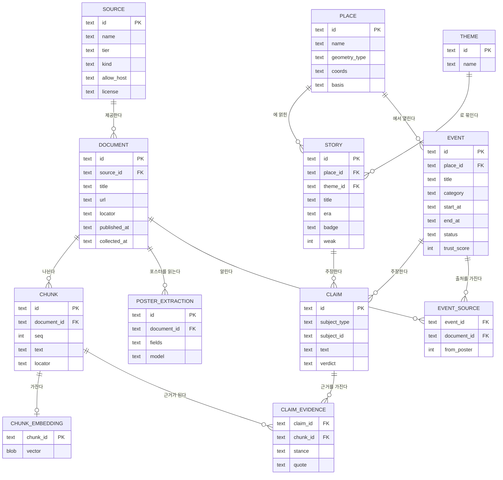
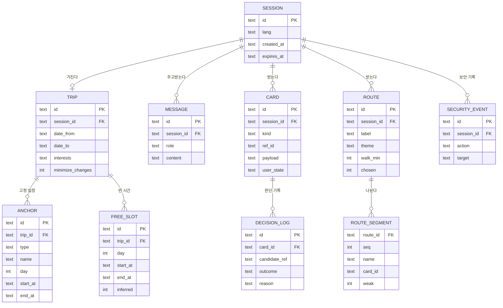

# 05. 데이터베이스

> 저장소 선택은 `[제안]`이다. 테이블 구조는 `AGENT_CONTEXT.md` 3.3의 공통 계약을 저장할 수 있게 잡았다.

## 1. 저장소 선택 `[제안]`

> ⚠ 미해결 충돌: D8 과 어긋남(저장소·검색: 로컬 색인은 SQLite FTS5 trigram + `Retriever`), D10 과 어긋남(파이프라인 출력은 `kc-bundle/v1` 파일, 승인 상태는 hitl DB) — 스키마 전체 재작성은 사람 결정 대기

**SQLite 파일 두 개를 쓴다.**

| 파일 | 내용 | 샌드박스에서 | 수명 |
|---|---|---|---|
| `knowledge.db` | 출처, 문서, 조각, 주장, 장소, 이야기, 행사 | **읽기 전용** | 수집 작업이 만든다. 이미지에 담아 배포 |
| `user.db` | 세션, 여행, 대화, 카드, 경로, 판단 기록 | 쓰기 가능 | 세션이 끝나면 지운다 |

이렇게 나누는 이유:

- OpenShell의 파일 정책과 그대로 맞는다. 지식 DB가 있는 폴더는 `read_only`, 사용자 DB 폴더만 `read_write`.
- "에이전트가 원자료를 바꿀 수 없다"와 "사용자 일정은 샌드박스 안에만 있다"를 저장소 수준에서 보여줄 수 있다.
- 서버를 따로 띄우지 않아도 되어 해커톤 일정에 맞다.

**벡터 검색:** `sqlite-vec` 확장 또는 FAISS 색인 파일. 조각 수가 수천 건 수준이면 어느 쪽이든 충분하다. 아래 DDL은 임베딩을 별도 테이블에 두어 둘 중 무엇을 써도 되게 했다.

**대안:** 여러 사람이 동시에 쓰는 서비스로 키울 때는 PostgreSQL + pgvector + PostGIS로 옮긴다. 테이블 구조는 그대로 쓸 수 있다. 외부에 호스팅된 DB를 쓰면 사용자 일정이 샌드박스 밖으로 나가므로, 그 경우 "밖으로 나가지 않는다"는 설명을 바꿔야 한다.

**좌표:** WGS84 위도·경도를 실수로 저장한다. 선과 영역은 `[[lat, lng], …]` 형태의 JSON 문자열. 범위 검색은 위도·경도 상자 조건으로 충분하다.

## 2. 지식 DB — ERD



## 3. 지식 DB — 테이블

### 3.1 출처와 문서

```sql
-- 어디서 가져왔는가. 06_DATA_SOURCES.md의 한 줄이 한 행이다.
CREATE TABLE source (
  id          TEXT PRIMARY KEY,              -- 'sillok', 'tourapi', 'jongno_gu'
  name        TEXT NOT NULL,                 -- 화면의 출처 태그에 쓰는 이름
  name_en     TEXT,
  tier        TEXT NOT NULL CHECK (tier IN ('S','A','B','C','D')),
  kind        TEXT NOT NULL,                 -- 'primary','reference','api','gov_board','press','sns'
  base_url    TEXT,
  allow_host  TEXT,                          -- policy.yaml에 넣는 호스트명
  license     TEXT,                          -- 공공누리 유형 등
  note        TEXT
);

-- 가져온 것 한 건. 사료 기사 하나, 사전 항목 하나, 게시글 하나, API 응답의 행사 하나.
CREATE TABLE document (
  id            TEXT PRIMARY KEY,
  source_id     TEXT NOT NULL REFERENCES source(id),
  title         TEXT,
  url           TEXT,
  locator       TEXT,                        -- 문서 단위 위치: '세종 12년 3월 4일 2번째 기사', '게시글 1234'
  published_at  TEXT,                        -- 게시일·간행일 (ISO 8601, 연도만 있어도 됨)
  updated_at    TEXT,                        -- 출처가 밝힌 갱신일
  collected_at  TEXT NOT NULL,               -- 우리가 수집한 날짜. 반드시 저장
  content_hash  TEXT NOT NULL,               -- 변경 감지용
  raw_path      TEXT,                        -- 원문·이미지 파일 경로
  lang          TEXT DEFAULT 'ko'
);
CREATE INDEX idx_document_source ON document(source_id, published_at);

-- 검색과 근거의 단위.
CREATE TABLE chunk (
  id           TEXT PRIMARY KEY,
  document_id  TEXT NOT NULL REFERENCES document(id),
  seq          INTEGER NOT NULL,
  text         TEXT NOT NULL,
  locator      TEXT                          -- 조각 단위 위치: 'p.214', '3번째 문단'
);
CREATE INDEX idx_chunk_document ON chunk(document_id, seq);

CREATE TABLE chunk_embedding (
  chunk_id  TEXT PRIMARY KEY REFERENCES chunk(id),
  model     TEXT NOT NULL,
  vector    BLOB NOT NULL
);
```

**출처 태그는 이렇게 만들어진다:** `[source.tier] source.name · chunk.locator 또는 document.locator`. 쪽수와 날짜를 수집할 때 저장하지 않으면 태그를 만들 수 없다.

### 3.2 장소, 이야기, 행사

```sql
-- 지도에 그릴 수 있는 것. 이야기와 행사가 함께 쓴다.
CREATE TABLE place (
  id             TEXT PRIMARY KEY,
  name           TEXT NOT NULL,
  name_en        TEXT,
  aliases        TEXT,                       -- JSON 배열: 옛 지명, 다른 표기
  district       TEXT,                       -- '종로구'
  geometry_type  TEXT NOT NULL CHECK (geometry_type IN ('point','segment','area','approx')),
  lat            REAL NOT NULL,              -- 대표 좌표 (범위 검색용)
  lng            REAL NOT NULL,
  coords         TEXT,                       -- 선·영역의 좌표 목록 JSON
  radius_m       INTEGER,                    -- approx일 때
  basis          TEXT,                       -- 위치의 근거: '발굴','고지도 비정','표석 위치','주소','포스터 문구'
  basis_note     TEXT
);
CREATE INDEX idx_place_latlng ON place(lat, lng);

CREATE TABLE theme (
  id    TEXT PRIMARY KEY,                    -- 'royal_procession','waterway','market','office','hill'
  name  TEXT NOT NULL,                       -- '왕의 길'
  name_en TEXT
);

-- 이야기 길의 카드 원본.
CREATE TABLE story (
  id         TEXT PRIMARY KEY,
  place_id   TEXT NOT NULL REFERENCES place(id),
  theme_id   TEXT REFERENCES theme(id),
  title      TEXT NOT NULL,
  title_en   TEXT,
  era        TEXT,                           -- '조선 후기', '1760년'
  badge      TEXT NOT NULL CHECK (badge IN ('기록','전승','추정')),
  weak       INTEGER NOT NULL DEFAULT 0,     -- 옛길과 대체로 겹치는 수준이면 1. 지도에서 점선
  body       TEXT NOT NULL,                  -- 사실 층. 문장마다 근거 번호
  body_en    TEXT,
  disputed   INTEGER NOT NULL DEFAULT 0,     -- 이설 있음
  value      REAL,                           -- 이야기 가치 점수
  status     TEXT NOT NULL DEFAULT 'draft'   -- 'draft','verified','rejected'
             CHECK (status IN ('draft','verified','rejected'))
);
CREATE INDEX idx_story_place ON story(place_id);
CREATE INDEX idx_story_theme ON story(theme_id, status);

-- 지금의 한국의 카드 원본.
CREATE TABLE event (
  id               TEXT PRIMARY KEY,
  place_id         TEXT REFERENCES place(id),
  title            TEXT NOT NULL,
  title_en         TEXT,
  category         TEXT NOT NULL,            -- '야장','축제','공연','시장','전시','팝업'
  start_at         TEXT,                     -- ISO 8601
  end_at           TEXT,
  time_text        TEXT,                     -- '매일 18:00~23:00' 같은 원문 표현
  organizer        TEXT,
  conditions       TEXT,                     -- JSON: 우천 시, 사전 신청, 현금만 등
  serves_alcohol   INTEGER NOT NULL DEFAULT 0,
  indoor           INTEGER,                  -- 1 실내, 0 야외, NULL 모름
  status           TEXT NOT NULL CHECK (status IN ('confirmed','needs_check','on_hold','expired')),
  trust_score      INTEGER,
  status_reason    TEXT,
  poster_path      TEXT,
  last_checked_at  TEXT NOT NULL
);
CREATE INDEX idx_event_period ON event(start_at, end_at, status);
CREATE INDEX idx_event_place ON event(place_id);

CREATE TABLE event_source (
  event_id      TEXT NOT NULL REFERENCES event(id),
  document_id   TEXT NOT NULL REFERENCES document(id),
  from_poster   INTEGER NOT NULL DEFAULT 0,
  extracted     TEXT,                        -- 이 출처에서 뽑은 날짜·시간·장소 JSON
  PRIMARY KEY (event_id, document_id)
);

CREATE TABLE poster_extraction (
  id           TEXT PRIMARY KEY,
  document_id  TEXT NOT NULL REFERENCES document(id),
  image_path   TEXT NOT NULL,
  model        TEXT NOT NULL,
  fields       TEXT NOT NULL,                -- JSON: 행사명, 날짜, 시간, 장소, 주최, 조건, 항목별 확신도
  year_resolved_by TEXT,                     -- 'poster','post_date','weekday','unresolved'
  conflicts    TEXT,                         -- 본문과 다른 항목 JSON
  created_at   TEXT NOT NULL
);
```

### 3.3 주장과 근거

```sql
-- 판정의 단위. 이야기와 행사 모두 주장들로 이루어진다.
CREATE TABLE claim (
  id            TEXT PRIMARY KEY,
  subject_type  TEXT NOT NULL CHECK (subject_type IN ('story','event')),
  subject_id    TEXT NOT NULL,
  text          TEXT NOT NULL,
  verdict       TEXT NOT NULL CHECK (verdict IN ('accepted','rejected','disputed','unverified')),
  confidence    TEXT CHECK (confidence IN ('high','medium','low')),
  reason        TEXT,
  judged_by     TEXT,                        -- 서버가 주입한다. 모델 출력·도구 파라미터로 받지 않는다. 'human' 은 사람 전용 API 만 기록
  judged_at     TEXT
);
CREATE INDEX idx_claim_subject ON claim(subject_type, subject_id);

CREATE TABLE claim_evidence (
  claim_id   TEXT NOT NULL REFERENCES claim(id),
  chunk_id   TEXT NOT NULL REFERENCES chunk(id),
  stance     TEXT NOT NULL CHECK (stance IN ('support','contradict','mention')),
  quote      TEXT NOT NULL,                  -- 근거가 된 원문 구절. 출처 태그를 누르면 보인다
  says       TEXT,                           -- 반박일 때 그 출처의 주장
  PRIMARY KEY (claim_id, chunk_id)
);
```

## 4. 사용자 DB — ERD



## 5. 사용자 DB — 테이블

```sql
CREATE TABLE session (
  id          TEXT PRIMARY KEY,
  lang        TEXT NOT NULL DEFAULT 'ko' CHECK (lang IN ('ko','en')),
  created_at  TEXT NOT NULL,
  expires_at  TEXT NOT NULL                  -- 지나면 세션과 딸린 행을 모두 지운다
);

CREATE TABLE trip (
  id                TEXT PRIMARY KEY,
  session_id        TEXT NOT NULL UNIQUE REFERENCES session(id) ON DELETE CASCADE,
  date_from         TEXT,
  date_to           TEXT,
  interests         TEXT,                    -- JSON 배열
  party             TEXT,                    -- JSON: size, kids, mobility_limited, luggage
  minimize_changes  INTEGER NOT NULL DEFAULT 1,
  weather           TEXT                     -- JSON. 사용자가 말한 경우에만
);

-- 사용자가 정한 일정. 에이전트는 이 행을 바꾸지 않는다(사용자가 말했을 때만).
CREATE TABLE anchor (
  id           TEXT PRIMARY KEY,
  trip_id      TEXT NOT NULL REFERENCES trip(id) ON DELETE CASCADE,
  type         TEXT NOT NULL CHECK (type IN ('flight','hotel','train','bus','visit')),
  name         TEXT NOT NULL,
  day          INTEGER,
  lat          REAL,
  lng          REAL,
  start_at     TEXT,
  end_at       TEXT,
  source_text  TEXT                          -- 사용자 글의 어느 부분에서 뽑았는지
);
CREATE INDEX idx_anchor_trip ON anchor(trip_id, day, start_at);

CREATE TABLE free_slot (
  id        TEXT PRIMARY KEY,
  trip_id   TEXT NOT NULL REFERENCES trip(id) ON DELETE CASCADE,
  day       INTEGER NOT NULL,
  start_at  TEXT NOT NULL,
  end_at    TEXT NOT NULL,
  near      TEXT,
  lat       REAL,
  lng       REAL,
  inferred  INTEGER NOT NULL DEFAULT 1,
  assumption TEXT                            -- 사용자에게 밝힌 가정 한 줄
);

CREATE TABLE message (
  id          TEXT PRIMARY KEY,
  session_id  TEXT NOT NULL REFERENCES session(id) ON DELETE CASCADE,
  role        TEXT NOT NULL CHECK (role IN ('user','assistant','system')),
  content     TEXT NOT NULL,
  created_at  TEXT NOT NULL
);
CREATE INDEX idx_message_session ON message(session_id, created_at);

-- 사용자에게 보여준 카드. payload는 공통 계약의 카드 JSON 그대로다.
-- 보여준 시점의 내용을 고정해 두어야 (여행 기록은 이번 범위 밖) 나중에 "그날 기준"으로 다시 보여줄 수 있다.
CREATE TABLE card (
  id          TEXT PRIMARY KEY,
  session_id  TEXT NOT NULL REFERENCES session(id) ON DELETE CASCADE,
  kind        TEXT NOT NULL CHECK (kind IN ('story','now')),
  ref_id      TEXT NOT NULL,                 -- knowledge.db의 story.id 또는 event.id
  payload     TEXT NOT NULL,                 -- 카드 JSON 전체
  slot_day    INTEGER,
  slot_at     TEXT,
  as_of       TEXT,                          -- 이 정보의 기준 날짜
  -- user_state 전이는 사람이 쓰는 사용자 API 로만 한다(D2). 에이전트는 'proposed' 로 제안(draft)만 만든다
  user_state  TEXT NOT NULL DEFAULT 'proposed'
              CHECK (user_state IN ('proposed','added','visited','skipped')),
  created_at  TEXT NOT NULL,
  state_changed_at TEXT
);
CREATE INDEX idx_card_session ON card(session_id, user_state);

CREATE TABLE route (
  id              TEXT PRIMARY KEY,
  session_id      TEXT NOT NULL REFERENCES session(id) ON DELETE CASCADE,
  request_id      TEXT NOT NULL,             -- 같은 요청에서 나온 A·B·C를 묶는다
  label           TEXT NOT NULL CHECK (label IN ('A','B','C')),
  theme           TEXT,
  walk_min        INTEGER NOT NULL,          -- 경로 엔진 값
  delta_min       INTEGER NOT NULL,
  distance_m      INTEGER,
  story_count     INTEGER NOT NULL,
  badge_mix       TEXT,                      -- JSON
  badges          TEXT,                      -- JSON 배열: 추천, 가장 빠름, 이야기 가장 많음
  recommend_reason TEXT,
  geometry        TEXT NOT NULL,             -- 경로 좌표 목록 JSON
  estimated       INTEGER NOT NULL DEFAULT 0,-- 경로 엔진 실패로 어림한 값이면 1
  chosen          INTEGER NOT NULL DEFAULT 0,
  walked          INTEGER NOT NULL DEFAULT 0,
  created_at      TEXT NOT NULL
);

CREATE TABLE route_segment (
  route_id   TEXT NOT NULL REFERENCES route(id) ON DELETE CASCADE,
  seq        INTEGER NOT NULL,
  name       TEXT,                           -- 이름표. 이야기 없는 구간은 NULL
  card_id    TEXT REFERENCES card(id),
  length_m   INTEGER,
  walk_min   INTEGER,
  weak       INTEGER NOT NULL DEFAULT 0,
  geometry   TEXT NOT NULL,
  PRIMARY KEY (route_id, seq)
);

-- 판단 근거 패널의 원본. 채택한 것과 탈락한 것을 모두 남긴다.
CREATE TABLE decision_log (
  id             TEXT PRIMARY KEY,
  session_id     TEXT NOT NULL REFERENCES session(id) ON DELETE CASCADE,
  request_id     TEXT NOT NULL,
  card_id        TEXT REFERENCES card(id),
  candidate_ref  TEXT NOT NULL,              -- story.id, event.id 또는 document.id
  candidate_title TEXT,
  outcome        TEXT NOT NULL CHECK (outcome IN ('accepted','rejected')),
  reason_code    TEXT,                       -- 'expired','too_far','interest_mismatch','duplicate',
                                             -- 'unsuitable','no_evidence','irrelevant','on_hold','conflict_resolved'
  reason         TEXT,                       -- 사용자에게 보여줄 한 줄
  detail         TEXT,                       -- 판정 레코드 JSON (충돌한 주장과 선택)
  created_at     TEXT NOT NULL
);
CREATE INDEX idx_decision_request ON decision_log(request_id);

-- ⚠ 미해결 충돌: D4 와 어긋남(audit 입력은 audit/v1 JSONL) — 사람 결정 대기
-- 보안 로그 화면의 원본. 앱이 직접 겪은 거부와 OpenShell 로그에서 가져온 것.
CREATE TABLE security_event (
  id          TEXT PRIMARY KEY,
  session_id  TEXT REFERENCES session(id) ON DELETE CASCADE,
  ts          TEXT NOT NULL,
  action      TEXT NOT NULL CHECK (action IN ('allow','deny','pending','approved','rejected')),
  target_kind TEXT NOT NULL CHECK (target_kind IN ('network','file','tool')),
  target      TEXT NOT NULL,                 -- 호스트, 경로, 도구 이름
  reason      TEXT,
  origin      TEXT NOT NULL CHECK (origin IN ('app','openshell'))
);
```

## 6. 자주 쓰는 조회

**그 날짜, 그 주변의 유효한 행사**

```sql
SELECT e.*, p.lat, p.lng, p.geometry_type
FROM event e JOIN place p ON p.id = e.place_id
WHERE e.status IN ('confirmed','needs_check')
  AND e.start_at <= :slot_end AND e.end_at >= :slot_start
  AND p.lat BETWEEN :lat_min AND :lat_max
  AND p.lng BETWEEN :lng_min AND :lng_max;
```

**출발–도착 범위의 검증된 이야기**

```sql
SELECT s.*, p.lat, p.lng, p.geometry_type, p.coords, t.name AS theme_name
FROM story s JOIN place p ON p.id = s.place_id LEFT JOIN theme t ON t.id = s.theme_id
WHERE s.status = 'verified'
  AND p.lat BETWEEN :lat_min AND :lat_max
  AND p.lng BETWEEN :lng_min AND :lng_max;
```

**카드의 출처 태그**

```sql
SELECT src.tier, src.name, COALESCE(c.locator, d.locator) AS locator,
       d.url, d.published_at, d.collected_at, ce.quote, ce.stance
FROM claim cl
JOIN claim_evidence ce ON ce.claim_id = cl.id
JOIN chunk c ON c.id = ce.chunk_id
JOIN document d ON d.id = c.document_id
JOIN source src ON src.id = d.source_id
WHERE cl.subject_type = :type AND cl.subject_id = :id AND cl.verdict = 'accepted';
```

**여행 기록** (`[제안]`, 이번 범위 밖. 마지막에 별도 agent 하나로 붙인다)

```sql
SELECT * FROM card
WHERE session_id = :sid AND user_state IN ('visited','added')
ORDER BY slot_day, slot_at, created_at;
```

## 7. 운영 규칙

- **수집일은 반드시 저장한다.** 지금의 한국의 판정은 날짜에 달려 있다.
- **지식 DB는 대화 중에 고치지 않는다.** 고칠 것이 있으면 수집 작업을 다시 돌려 새 파일로 바꾼다.
- **사용자 DB는 세션 단위로 지운다.** `expires_at`이 지난 세션을 주기적으로 삭제한다. 데모에서는 세션 종료 시 바로 지운다.
- **카드 payload는 보여준 그대로 고정한다.** 나중에 원본 행사가 바뀌어도 기록은 그날 기준으로 남는다(여행 기록은 이번 범위 밖).
- **씨앗 자료는 `status = 'draft'`로 넣는다.** 근거를 확인한 것만 `verified`로 올린다(승격은 사람 전용 경로로만, D2). **승격 경로는 미정이다**(코드·sprint-2 에 없다). "화면에는 `verified` 만"은 D10 의 제안 지위 카드와 어긋날 수 있다 ⚠ 미해결 충돌: D10 과 어긋남 — 사람 결정 대기
- 저장소에는 DB 파일이 아니라 **만드는 절차**(DDL, 수집 스크립트, 씨앗 CSV)를 올린다. 원문을 재배포해도 되는 자료만 함께 올린다 `[확인 필요: 출처별 이용 조건]`.
