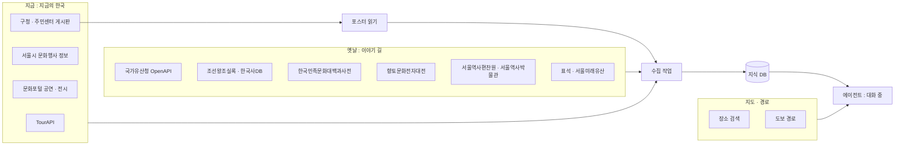

# 06. 데이터 출처

> 실제로 자료를 가져올 곳과 방법이다. 조사일 2026-10-07.
> **확인** 열: `확인함`은 이번에 문서나 안내 페이지로 확인한 것, `확인 필요`는 기억이나 추정에 기댄 것이다. `확인 필요`인 주소는 구현 전에 직접 열어 본다.
> 호스트명은 `policy.yaml`의 허용 목록에 그대로 들어간다. 틀리면 접근이 거부된다.

## 1. 한눈에 보기

수집은 미리 하고, 대화 중에 밖으로 나가는 것은 지도·경로와 모델 호출뿐이다.

## 2. 지금 (지금의 한국)

우선순위는 기획서를 따른다: 공식 API 우선, 지자체 웹 보완.

### 2.1 한국관광공사 TourAPI — 1순위

| 항목 | 내용 | 확인 |
|---|---|---|
| 제공 | 한국관광공사 (공공데이터포털) | 확인함 |
| 기본 주소 | `https://apis.data.go.kr/B551011/KorService2` | 확인함 |
| 허용 호스트 | `apis.data.go.kr` (443) | 확인함 |
| 쓸 오퍼레이션 | `searchFestival2`(행사·축제, 기간 조건), `locationBasedList2`(좌표 주변), `detailCommon2`·`detailIntro2`(상세), `areaBasedSyncList2`(변경분 동기화) | 이름은 확인함. 파라미터는 확인 필요 |
| 인증 | 공공데이터포털에서 활용 신청 후 서비스 키. 요청의 쿼리 파라미터로 넣는다 | 확인 필요 |
| 등급 | B | |
| 얻는 것 | 행사명, 기간, 장소, 좌표, 주최, 소개, 이미지 | |
| 주의 | 소규모 상권 행사는 다 들어오지 않는다. 이미지 저작권 유형을 확인한다. 호출 한도가 있다 | |

- 신청 페이지: https://www.data.go.kr/data/15101578/openapi.do
- 가이드: https://api.visitkorea.or.kr/
- 버전: 2025년 5월 기준 문서가 "TourAPI 4.0 Ver 4.3"으로 안내된다. 오퍼레이션 이름 끝의 `2`가 이 버전이다.

### 2.2 서울시 문화행사 정보 — 1순위

| 항목 | 내용 | 확인 |
|---|---|---|
| 제공 | 서울특별시 (서울 열린데이터광장). 원천은 서울문화포털 | 확인함 |
| 데이터셋 | OA-15486 "서울시 문화행사 정보" | 확인함 |
| 요청 형식 | `http://openapi.seoul.go.kr:8088/{인증키}/json/culturalEventInfo/{시작}/{끝}/` | **확인 필요** |
| 허용 호스트 | `openapi.seoul.go.kr` (**8088번 포트**) | 확인 필요 |
| 인증 | 열린데이터광장에서 인증키 발급. 주소 경로에 넣는다 | 확인 필요 |
| 등급 | B | |
| 얻는 것 | 분류, 자치구, 행사명, 장소, 날짜, 기관명, 이용대상, 요금, 프로그램, 홈페이지, 좌표(위·경도), 시작일, 종료일, 유·무료, 행사시간 | 확인함 |
| 갱신 | 매일 1회 | 확인함 |
| 이용 조건 | 공공누리 1유형(출처 표시, 상업적 이용·변경 가능) | 확인함 |

- 데이터셋 페이지: https://data.seoul.go.kr/dataList/OA-15486/S/1/datasetView.do
- **자치구 필드가 있어** 대상 자치구(현재 중구 먼저, 중구·종로구·마포구·강남구 위주. `regions/*.json` 참조)만 골라내기 쉽다. 해커톤에서 가장 먼저 붙일 후보다.
- 443이 아닌 포트와 평문 HTTP일 수 있다. OpenShell 정책에 포트를 정확히 적어야 하고, 평문 HTTP 요청을 검사·허용하는 방식을 확인해야 한다 `[확인 필요]`.
- 인증키가 주소 경로에 들어간다. OpenShell 프로바이더의 자격증명 치환이 경로에도 적용되는지 확인한다. 안 되면 `08_OPENSHELL_POLICY.md` 4장의 대안을 쓴다.

### 2.3 문화포털 공연·전시 — 1순위(보강)

| 항목 | 내용 | 확인 |
|---|---|---|
| 제공 | 한국문화정보원 (문화포털, 공공데이터포털) | 확인 필요 |
| 접근 | 공공데이터포털의 공연전시정보 조회 서비스 | 확인 필요 |
| 허용 호스트 | `apis.data.go.kr` 로 예상 | 확인 필요 |
| 등급 | B | |
| 얻는 것 | 공연·전시의 제목, 기간, 장소, 좌표 | 확인 필요 |

- 포털: https://www.culture.go.kr/
- 공공데이터포털에서 "공연전시정보조회"로 검색해 현재 제공 중인 서비스와 주소를 확인한다. 해커톤에서는 2.1과 2.2로 충분하면 건너뛴다.

### 2.4 구청·주민센터 게시판 — 2순위

API에 없는 야장, 골목 행사, 변경 공지가 여기에 **포스터 이미지로** 올라온다.

| 구 | 도메인 | 데모 지역 | 확인 |
|---|---|---|---|
| 중구 (데모 먼저) | `www.junggu.seoul.kr` | 덕수궁·정동 | 확인 필요 |
| 종로구 | `www.jongno.go.kr` | 종로, 익선동 | 확인 필요 |
| 마포구 | `www.mapo.go.kr` | 경의선 숲길 쪽 | 확인 필요 |
| 강남구 | 확인 필요 | 확인 필요 | [확인 필요] 출처 미확인 |

지역 목록은 확정이 아니다. 현재 기준은 `domains/kcontext/data/regions/*.json` 이다.

구마다 해야 할 일:

1. 행사·공지 게시판의 실제 주소와 목록·상세 페이지 구조를 확인한다.
2. `robots.txt`와 저작권 표시(공공누리 유형)를 확인한다.
3. 첨부 이미지의 주소 형식을 확인한다. 이미지가 다른 호스트에서 내려오면 그 호스트도 허용 목록에 넣어야 한다.
4. 게시일이 목록에 있는지 확인한다. 연도 없는 포스터의 연도를 정하는 데 쓴다.
5. 주민센터(동) 게시판이 구청 사이트 안에 있는지, 따로 있는지 확인한다.

수집 규칙: 요청 간격을 둔다. 포스터 이미지는 재배포하지 않고 원문 링크를 건다. 수집본을 로컬에 저장해 데모 당일 사이트 장애에 대비한다. 등급은 B.

### 2.5 그 밖

| 출처 | 용도 | 해커톤 |
|---|---|---|
| 공식 보도자료·공지 RSS | 변경·취소 감지 | 제공하는 기관만. 뒤로 미룬다 |
| 행사 주최 측 공식 SNS | 당일 변경 발견. 단독이면 "확인 필요" | 제외 권장 |
| 서울시 실시간 도시데이터, 기상청 | 혼잡도, 날씨 | 나중에 추가 |

## 3. 옛날 (이야기 길)

### 3.1 국가유산청 OpenAPI — S

| 항목 | 내용 | 확인 |
|---|---|---|
| 목록 검색 | `https://www.khs.go.kr/cha/SearchKindOpenapiList.do` | 확인함 |
| 상세 조회 | `https://www.khs.go.kr/cha/SearchKindOpenapiDt.do` | 확인함 |
| 허용 호스트 | `www.khs.go.kr` (443) | 확인함 |
| 인증 | 키 없이 호출 가능한 것으로 안내됨 | 확인 필요 |
| 파라미터 | 이름 `ccbaMnm1`, 시도 `ccbaCtcd`, 종목 `ccbaKdcd`, 관리번호 `ccbaAsno` | 확인함(제3자 문서) |
| 응답 | XML. 이름, 종목, 시도·시군구, 좌표, 설명 | 확인함(제3자 문서) |
| 얻는 것 | 지정 유산의 위치와 공식 설명. 좌표의 근거가 분명하다 | |

- 옛 도메인(`cha.go.kr`)이 쓰인 예제는 2024년 기관 명칭 변경 이전 자료다.

### 3.2 조선왕조실록, 한국사데이터베이스 — S

| 항목 | 내용 | 확인 |
|---|---|---|
| 조선왕조실록 | https://sillok.history.go.kr/ | 확인 필요 |
| 한국사데이터베이스 | https://db.history.go.kr/ | 확인 필요 |
| 승정원일기 | https://sjw.history.go.kr/ | 확인 필요 |
| 접근 | 공개 API를 확인하지 못했다. 웹에서 기사 단위로 열람 | 확인 필요 |

- **권장 방식: 손으로 고른다.** 데모에 쓸 이야기는 많아야 수십 건이다. 필요한 기사를 사람이 찾아 기사 주소, 날짜(예: "세종 ○년 ○월 ○일 ○번째 기사"), 원문 구절을 씨앗 파일에 적는다. 자동 수집은 이용 조건을 확인한 뒤에만 한다.
- 출처 태그의 위치 표시는 왕대·연·월·일과 기사 순번으로 한다.
- 국사편찬위원회가 공공데이터포털에 올린 파일 자료도 있다(예: 우리역사넷 한국사연대기, 엑셀 파일, 이용허락범위 제한 없음). 연대 확인용 보조 자료로 쓸 수 있다: https://www.data.go.kr/data/15155532/fileData.do

### 3.3 한국민족문화대백과사전 — A

| 항목 | 내용 | 확인 |
|---|---|---|
| 제공 | 한국학중앙연구원 | 확인함 |
| 사이트 | https://encykorea.aks.ac.kr/ | 확인 필요 |
| 공공데이터 | "한국학 전문사전 학술 콘텐츠". CSV 파일과 OpenAPI 모두 제공, 약 7만 5천 항목 | 확인함 |
| 이용 조건 | 이용허락범위 제한 없음으로 안내됨 | 확인함 |
| 얻는 것 | 인물, 제도, 유적, 지명 항목의 학술 서술 | |

- 파일: https://www.data.go.kr/data/15148089/fileData.do
- API: https://www.data.go.kr/data/15148089/openapi.do
- **파일로 받아 로컬에 색인하는 쪽이 낫다.** 대화 중 외부 호출이 줄고 허용 목록도 짧아진다.
- 위치 표시는 항목명과 집필 연도·개정 연도.

### 3.4 한국향토문화전자대전 — A

| 항목 | 내용 | 확인 |
|---|---|---|
| 사이트 | https://www.grandculture.net/ | 확인 필요 |
| 얻는 것 | 지역 단위의 역사, 민속, 지명 유래 | |
| 접근 | 공개 API 여부 확인 필요. 서울 자치구별 편찬 여부도 확인 필요 | 확인 필요 |

### 3.5 서울역사편찬원, 서울역사박물관 — A

| 항목 | 내용 | 확인 |
|---|---|---|
| 서울역사편찬원 | https://history.seoul.go.kr/ — 서울지명사전, 서울의 길·동네 관련 간행물 | 확인 필요 |
| 서울역사박물관 | https://museum.seoul.go.kr/ — 생활문화 조사 보고서, 고지도 | 확인 필요 |
| 접근 | 간행물 PDF와 웹 열람 | 확인 필요 |

- 지명 유래와 골목 단위 이야기의 주 자료다. **쪽수를 함께 적는다**(출처 태그의 `p.214`가 여기서 나온다).
- PDF는 손으로 고른 부분만 발췌해 씨앗 파일에 넣는다. 원문 재배포 가능 여부는 간행물마다 확인한다.

### 3.6 표석, 서울미래유산 — B

| 항목 | 내용 | 확인 |
|---|---|---|
| 서울시 표석 정보 | 서울 열린데이터광장에서 데이터셋 검색 | 확인 필요 |
| 서울미래유산 | https://futureheritage.seoul.go.kr/ | 확인 필요 |
| 얻는 것 | 터의 위치 단서, 근현대 장소 | |

- 표석은 실제 터에서 떨어진 곳에 서 있는 경우가 많다. 좌표의 근거를 "표석 위치"로 적고, 표석 문구는 A 등급 이상 자료로 교차 확인한다.

### 3.7 고지도

수선전도, 경조오부도 등은 옛 물길과 길의 선형을 확인하는 근거다. 서울역사박물관, 국립중앙박물관(e뮤지엄), 서울대 규장각의 공개 이미지를 쓴다. 이미지마다 이용 조건을 확인한다 `[확인 필요]`. 지도 위에 직접 겹쳐 보여주는 것은 범위 밖이고, 구간 좌표를 정하는 참고 자료로만 쓴다.

## 4. 지도와 경로

이야기 길은 **경유지를 넣은 도보 경로**가 필요하다. 이 조건이 선택을 좌우한다.

### 4.1 도보 경로

⚠ 미해결 충돌: D9 와 어긋남(TMAP 우선 대 지도 엔진 우선순위·추정 표시) — 사람 결정 대기

| 후보 | 주소 | 경유지 | 확인 |
|---|---|---|---|
| **TMAP 보행자 경로** `[제안: 우선]` | `POST https://apis.openapi.sk.com/tmap/routes/pedestrian?version=1` | `passList`로 최대 5곳 | 확인함(개발자 블로그) |
| 카카오맵 MCP (PlayMCP) | PlayMCP에 등록된 서버 | 확인 필요 | 도구 이름만 확인함: 도보·자전거·대중교통 길찾기, 키워드 장소 검색 |
| 샌드박스 안 경로 엔진 | 오픈스트리트맵 한국 추출본 + Valhalla 또는 OSRM | 가능 | 직접 구축 필요 |
| 네이버 지도 API | — | 도보 경로 제공 여부 확인 필요 | 확인 필요 |

**TMAP 보행자 경로 요약**

- 헤더 `appKey`에 키. SK open API에서 발급.
- 파라미터: `startX`, `startY`, `endX`, `endY`, `startName`, `endName`, `passList`, `reqCoordType`(`WGS84GEO`), `resCoordType`.
- **좌표 순서가 경도, 위도다.** X가 경도, Y가 위도. `passList`는 `경도,위도_경도,위도` 형식.
- 허용 호스트: `apis.openapi.sk.com` (443).
- 무료 호출 한도를 확인한다 `[확인 필요]`. 같은 구간은 결과를 저장해 다시 부르지 않는다.

**카카오맵 MCP를 쓰는 경우:** OpenShell 정책에서 도구 단위로 허용할 수 있다. 다만 PlayMCP 밖의 우리 샌드박스에서 직접 연결할 수 있는지, 경유지를 지원하는지 확인해야 한다 `[확인 필요]`.

**샌드박스 안 경로 엔진:** 외부 호출이 아예 없어 구도가 가장 깔끔하지만 구축 시간이 든다. 시간이 남을 때의 선택지다.

### 4.2 장소 이름 → 좌표

| 후보 | 주소 | 확인 |
|---|---|---|
| 카카오 로컬 API 키워드 검색 | `GET https://dapi.kakao.com/v2/local/search/keyword.json` (헤더 `Authorization: KakaoAK {키}`) | 확인 필요 |
| TMAP 장소 검색 | `https://apis.openapi.sk.com/tmap/pois` | 확인 필요 |
| 네이버 지역 검색·지오코딩 | 네이버 클라우드 플랫폼 | 확인 필요 |
| 카카오맵 MCP의 장소 검색 도구 | PlayMCP | 확인 필요 |

경로를 TMAP으로 정하면 장소 검색도 TMAP으로 맞춰 허용 호스트를 하나로 줄이는 것이 좋다.

### 4.3 지도 화면

⚠ 미해결 충돌: D11 과 어긋남(지도 SDK·타일) — 사람 결정 대기

지도 타일은 사용자의 브라우저가 직접 받으므로 샌드박스 정책과 무관하다. 지도 SDK마다 키와 도메인 등록이 필요할 수 있고, 데모 주소가 바뀌면 다시 등록해야 한다 `[확인 필요]`. 등록이 필요 없는 오픈스트리트맵 기반 타일을 쓰면 이 문제가 없다. 타일 제공처의 이용 정책을 지킨다.

## 5. 모델

⚠ 미해결 충돌: D1 과 어긋남(`integrate.api.nvidia.com` 직접 호출, 로컬 NIM) — 사람 결정 대기

| 대상 | 주소 | 허용 호스트 |
|---|---|---|
| Nemotron 대형 (호스팅) | `https://integrate.api.nvidia.com/v1` | `integrate.api.nvidia.com` (443) |
| 로컬 NIM (임베딩, 리랭커, 비전, 가드, 경량) | `http://host.openshell.internal:{포트}/v1` | `host.openshell.internal` (NIM마다 포트) |

## 6. 허용 호스트 정리

`policy.yaml`(`deploy/openshell/policy.yaml`, 사람만 고친다)에 들어갈 후보 목록이다. 확인이 끝난 것만 넣는다.

⚠ 미해결 충돌: D7 과 어긋남(수집은 호스트 수집기가 한다. 아래 "수집" 행의 샌드박스 허용 여부) — 사람 결정 대기

| 호스트 | 포트 | 쓰는 곳 | 접근 | 언제 |
|---|---|---|---|---|
| `integrate.api.nvidia.com` | 443 | 대형 모델 | 읽기·쓰기(POST) | 대화 중 |
| `host.openshell.internal` | NIM 포트들 | 로컬 모델 | 읽기·쓰기(POST) | 대화 중, 수집 |
| `apis.openapi.sk.com` | 443 | 도보 경로, 장소 검색 | POST 필요 | 대화 중 |
| `apis.data.go.kr` | 443 | TourAPI, 공공데이터포털 API | 읽기 전용 | 수집 |
| `openapi.seoul.go.kr` | 8088 | 서울시 문화행사 | 읽기 전용 | 수집 |
| `www.khs.go.kr` | 443 | 국가유산청 | 읽기 전용 | 수집 |
| `www.junggu.seoul.kr`, `www.jongno.go.kr`, `www.mapo.go.kr` (강남구는 [확인 필요]) | 443 | 구청 게시판 | 읽기 전용 | 수집 |

수집을 별도 샌드박스로 나누면 아래 네 줄은 `ingest`에만, 위 세 줄은 `agent`에만 들어간다.

## 7. 수집 전 체크리스트

- [ ] 공공데이터포털 계정, TourAPI 활용 신청과 서비스 키 (승인에 시간이 걸릴 수 있다)
- [ ] 서울 열린데이터광장 인증키, 요청 주소와 포트 확인
- [ ] SK open API 키(TMAP), 무료 한도 확인
- [ ] 구청 세 곳의 게시판 주소, 구조, robots.txt, 저작권 표시
- [ ] 국가유산청 API를 실제로 불러 응답 확인
- [ ] 한국학중앙연구원 파일 내려받아 구조 확인
- [ ] 이야기 씨앗마다 실록·사전·지명사전의 기사 주소, 날짜·쪽수, 원문 구절 확보
- [ ] 출처별 재배포 가능 여부 (공개 저장소에 무엇을 올릴 수 있는가)

## 8. 조사에 참고한 곳

- 서울시 문화행사 정보 데이터셋: https://data.seoul.go.kr/dataList/OA-15486/S/1/datasetView.do
- TourAPI 안내(공공데이터포털): https://www.data.go.kr/data/15101578/openapi.do
- TourAPI 주소와 오퍼레이션 정리(제3자): https://skills.sh/2sem/korea-tourapi-skill/korea-tourapi
- 국가유산청 API 사용 정리(제3자): https://raw.githubusercontent.com/NomaDamas/k-skill/main/docs/features/korean-heritage-search.md
- TMAP 보행자 경로 사용기(개발자 블로그): https://velog.io/@ghenmaru/TMAP-TMAP-API-도보-길찾기
- 한국학 전문사전 학술 콘텐츠: https://www.data.go.kr/data/15148089/fileData.do
- 카카오 PlayMCP와 카카오맵 MCP 도구: https://wikidocs.net/294002

제3자 문서로 확인한 것은 공식 문서에서 한 번 더 확인한다.
